# Week 1 — App Containerization

## Homework

#### [Watch How to Ask for Technical Help Video](https://www.youtube.com/watch?v=tDPqmwKMP7Y&list=PLBfufR7vyJJ7k25byhRXJldB5AiwgNnWv&index=29)
* Very good information and helpful, I try to answer questions that people have in Discord when I can but sometimes it's hard to debug with the information that some students give. Hopefully this helps.

#### [Watch Grading Homework Summaries](https://www.youtube.com/watch?v=FKAScachFgk&list=PLBfufR7vyJJ7k25byhRXJldB5AiwgNnWv&index=25)
* I hope I've been clear and concise here but this is a good example of how to be straight and to the point.

#### [Watch Week 1 Live Streamed Video](https://www.youtube.com/watch?v=zJnNe5Nv4tE&list=PLBfufR7vyJJ7k25byhRXJldB5AiwgNnWv&index=22)
* I had to go back to watch this video after the live stream because there were some things that I missed and it moved a bit fast but after a review I got everything working correctly. One thing that I noticed was slight variations between my VS Code layout and Andrew's. Particularly in the extensions and ports sections of the IDE.
* #### There is an exposed ports tab which Andrew's IDE did not have.
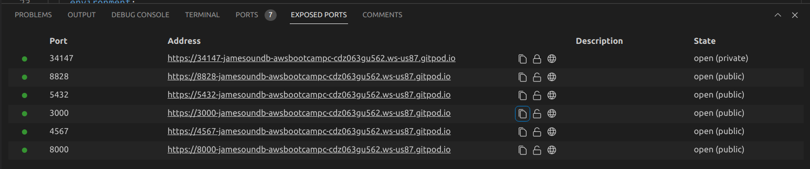 
#### Active ports show green instead of white.
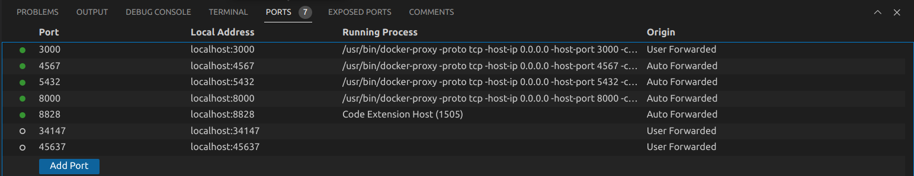
* #### My postgreSQL extension comes from the same author but the icon in my IDE is totally different and it had slightly different methods of operation but I was still able to get everything to run properly.
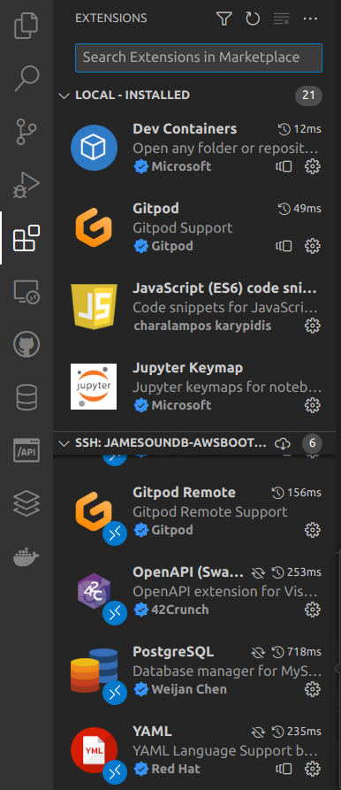
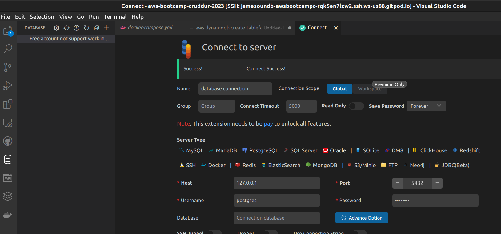

#### [Watch Remember to Commit Your Code Video](https://www.youtube.com/watch?v=b-idMgFFcpg&list=PLBfufR7vyJJ7k25byhRXJldB5AiwgNnWv&index=23)
* I got burned on this, I accidentally closed my workspace after the live stream without committing my code. It was ok though since I needed to go back over the video to get everything nailed down. Live and learn!

#### [Watch Chirag's Week 1 Spending Considerations](https://www.youtube.com/watch?v=OAMHu1NiYoI&list=PLBfufR7vyJJ7k25byhRXJldB5AiwgNnWv&index=24)
* Solid as always from Chirag, I've been keeping track of my Gitpod billing and I still have about 58% left for the month.

#### [Watch Ashish's Week 1 Container Security Considerations](https://www.youtube.com/watch?v=OjZz4D0B-cA&list=PLBfufR7vyJJ7k25byhRXJldB5AiwgNnWv&index=25)
* Another good video from Ashish, learning about container escaping was interesting and it's another good example of why running things as a non-root user is always the way to go.

#### Containerize Application(Dockerfiles, Docker Compose)
* #### I got the frontend communicating with the backend after a bit of tinkering.
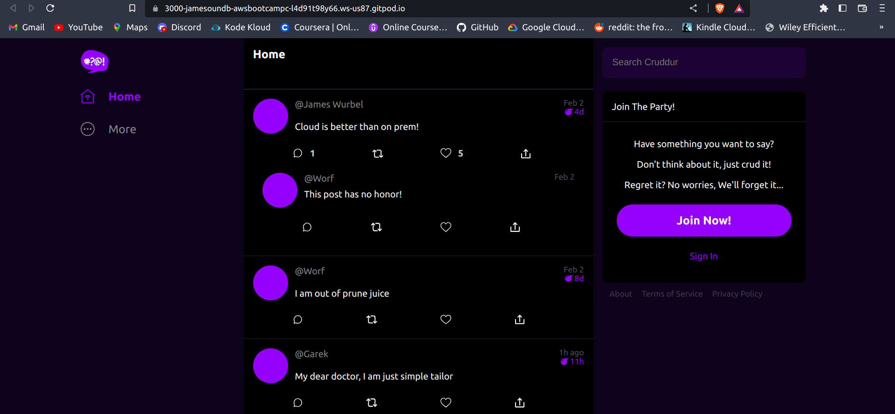

#### Document the Notification Endpoint for the OpenAI Document
* #### I really like the OpenAI extension, opening up the interface on the left hand side is super helpful to see how everything is laid out.
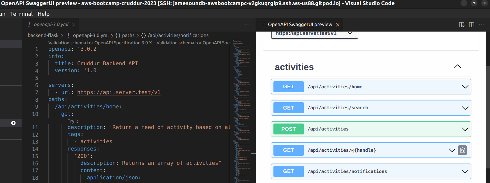

#### Write a Flask Backend Endpoint for the Notifications
* #### Nothing like a little Yoda JSON to keep you motivated! The JSON Viewer Pro is a great browser extension that makes viewing JSON much easier in my opinion.
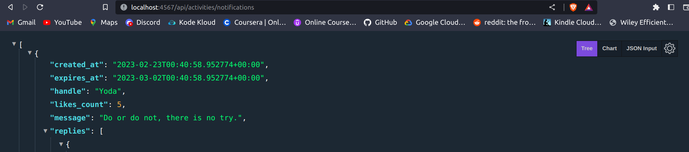

#### Write a React Page for Notifications
* #### Yoda always gives good advice!
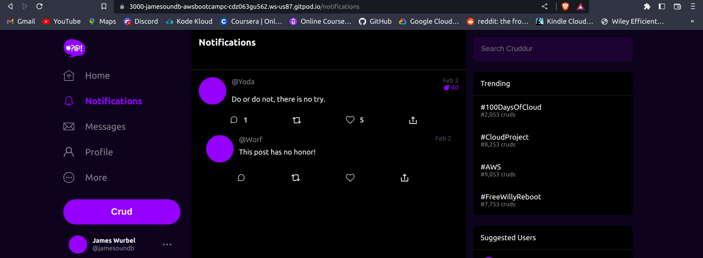
 
#### Run Dynamodb Local Container and ensure it works
* #### I added another table besides the example, yes more StarWars!
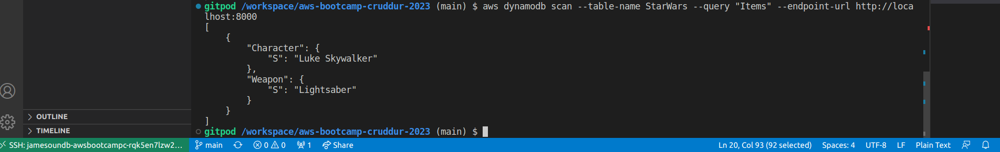
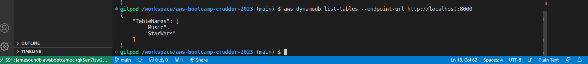
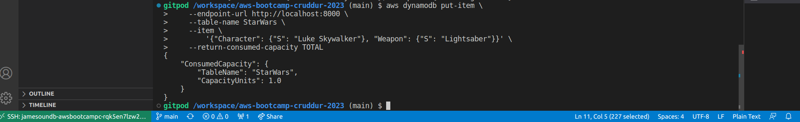

#### Run Postgres Container and ensure it works
* #### I got Postgres working even despite the totally different extension layout than the one Andrew showed in his example. I'm not sure why it is so different other than I'm sure our versions of VS Code are probably different and I'm pretty sure that's the reason.
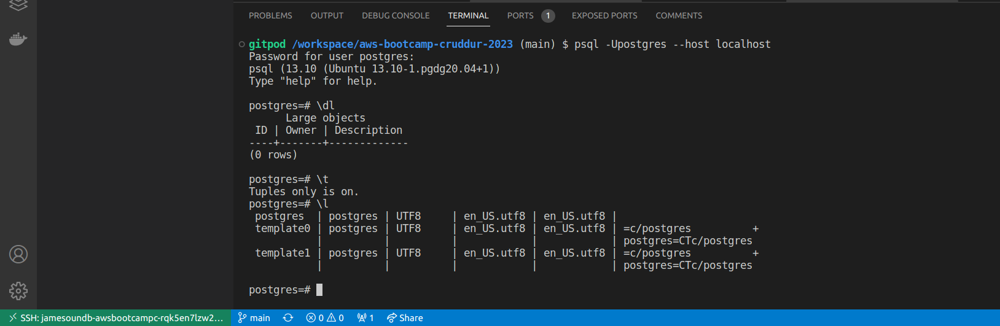

## Homework Challenges

#### Update my .gitpod.yml file to get rid of all of the vulnerabilities with npm as well as update the OS within the workspace.
* #### This was a bit more difficult than I thought that it would be. I was trying to eliminate the vulnerabilities listed in the npm install as well as update all of the apt packages. I used the Gitpod documentation to utilize the gp sync-done and gp sync-await commands which worked. I was able to do it successfully but the only issue is I have to create a new workspace every time for these changes to take place which is not ideal. I will be looking into other solutions in the coming weeks.
[.gitpod.yml file](https://github.com/jamesoundb/aws-bootcamp-cruddur-2023/blob/main/.gitpod.yml)

#### Ran a scan of one of my repositories using Snyk.
* #### I signed up for Snyk after watching Ashish's security video and I scanned one of my repositories. It was a repo using Terraform so it actually threw me a lot of false positives after I investigated it. They were triggered from tf variables and other resources that weren't defined in a way that the scan had expected I guess. Either way it was pretty cool to see Snyk in action and I'm sure I can utilize it in the future.
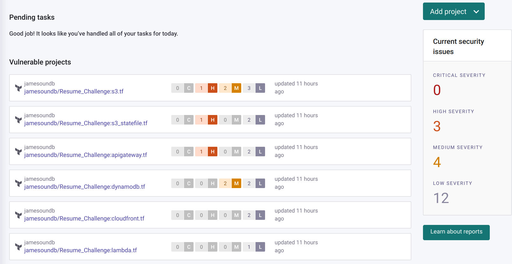
