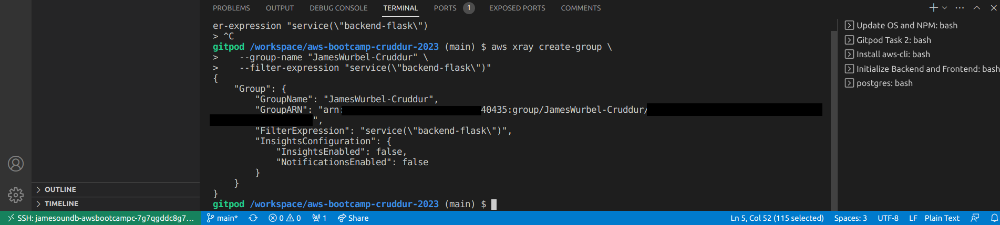
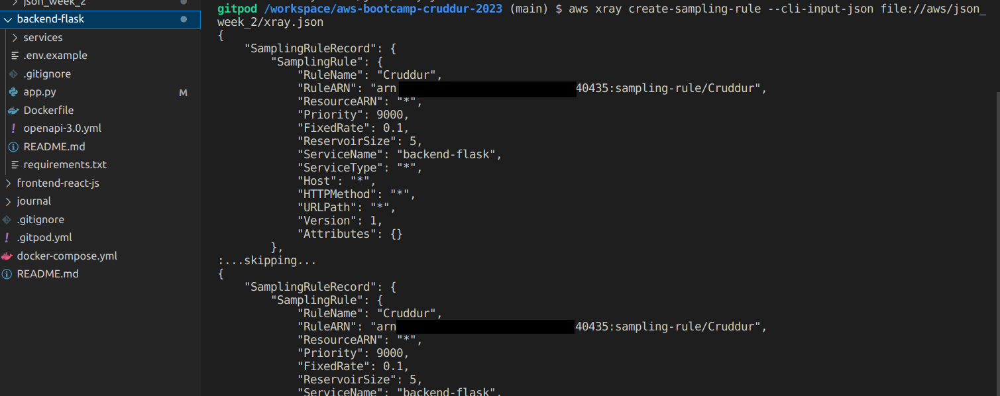

# Week 2 — Distributed Tracing

## Homework

#### [Watch Week 2 Live-Stream Video](https://www.youtube.com/watch?v=2GD9xCzRId4&list=PLBfufR7vyJJ7k25byhRXJldB5AiwgNnWv&index=30)
* I was able to follow along for most of the video but I had to watch it again because I did not have my environment setup correctly in Gitpod. I had misconfigured my .gitpod file with all of my tinkering and python wasn't installed. After fixing that I was able to get the traces and spans going with HoneyComb.
   
#### [Watch Chirag Spending Considerations](https://www.youtube.com/watch?v=2W3KeqCjtDY)
* A good breakdown of spending considerations for each of the services used for distributed tracing, observability, and monitoring. I'll be sure to check my CloudWatch logs as Chirag mentioned, I don't want any surprise bills. HoneyComb is super generous on their free tier and it will be more than enough for the bootcamp.

#### [Watch Ashish's Observability and Security Considerations](https://www.youtube.com/watch?v=bOf4ITxAcXc&list=PLBfufR7vyJJ7k25byhRXJldB5AiwgNnWv&index=31)
* Ashish is great, "Logging Sucks!" that cracked me up! First thing he mentioned and he isn't wrong! Digging through logs is monotonous and hopefully he is right about observability and the future. 

#### Instrument HoneyComb with OTEL
* #### I got all of this up and running without much trouble which was great, instrumenting HoneyComb was very straight forward because their documentation is really solid.

#### Instrument AWS X-Ray
* #### Holy cow, this was a lot more difficult than I thought it would be. I wrestled with this for quite sometime, I was able to get the initial trace and segment but adding annotations and metadata were unsolved at this point. I would really like to solve adding annotations in an easier fashion because you are able to search your segments and subsegments based on annotations only. Metadata is not for searches, and I could see how this feature would be beneficial for your SRE teams or Devs that want to filter the traces and segments. I did see Olga's article about tackling this so I know it's possible, I just wish the documentation for X-Ray was better. I'm sure it will improve.
* #### Here is the trace group that I created

* #### I created this sampling rule

* #### Log group in CloudWatch

* #### Raw data of the segment and subsegment

* #### A list of some X-Ray traces

#### Configure custom logger to send to CloudWatch Logs
* #### The documentation from AWS was great to be able to get this up and running with no problems.
* #### This was the CloudWatch log group details

* #### Here is a log event

#### Integrate Rollbar and capture an error
* #### I really like how staightforward Rollbar was for integration and it was easy to use. It's nice to be able to capture errors in this way and I can see how helpful this is to anyone looking to monitor errors.
* #### Here is two items that were errors and warnings that I was able to capture

* #### Nothing like a classic Hello World! test

## Homework Challenges

#### Get Codespaces set up and add envars for Codespaces in Github. Added a command in devcontainer.json to update and install npm in the frontend-react-js directory
* #### I wanted to get Codespaces configured like I have my Gitpod environment configured. I added some extra environment variables to Codespaces like the AWS_CLI_AUTO_PROMPT, HONEYCOMB_API_KEY, HONEYCOMB_SERVICE_NAME, and ROLLBAR_ACCESS_TOKEN. I was also able to add a command to update npm and run npm i in the frontend-react-js directory so I don't need to do that manually everytime I fire up the Codespaces environment.
* #### I added these environment variables to Codespaces in Github

* #### The frontend container up and running from the Codespaces environment

* #### The backend container up and running from the Codespaces environment

* #### This was the command that I utilized to run npm update and npm i in the frontend-react-js directory

