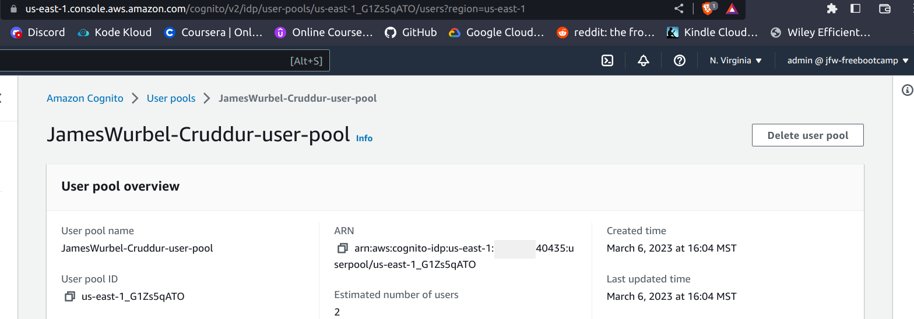
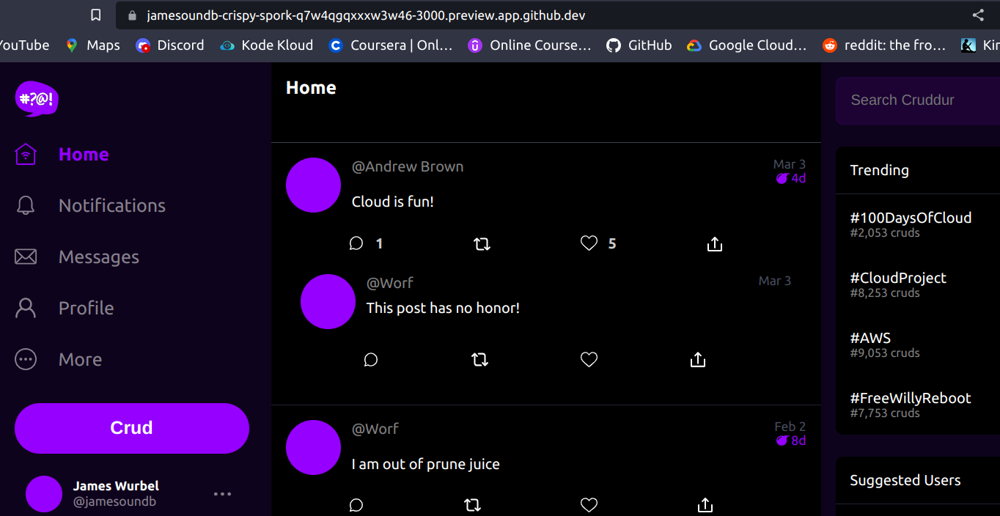
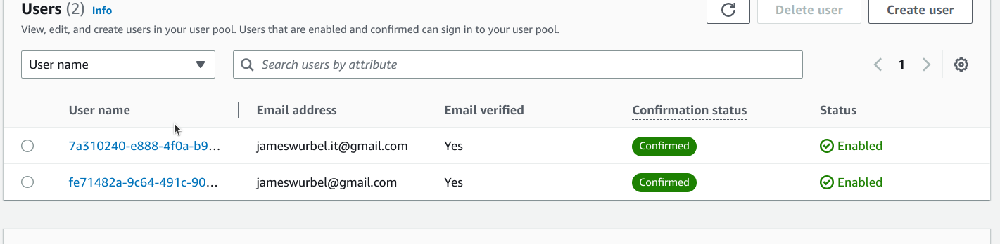
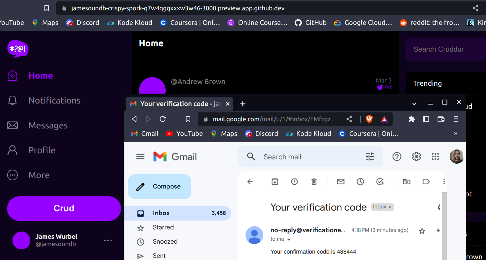
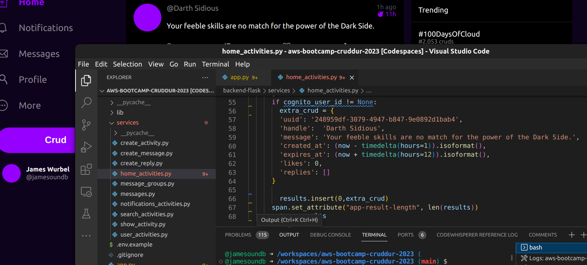
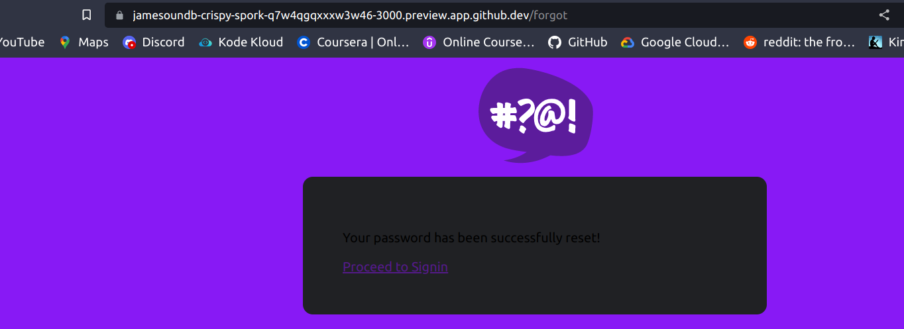
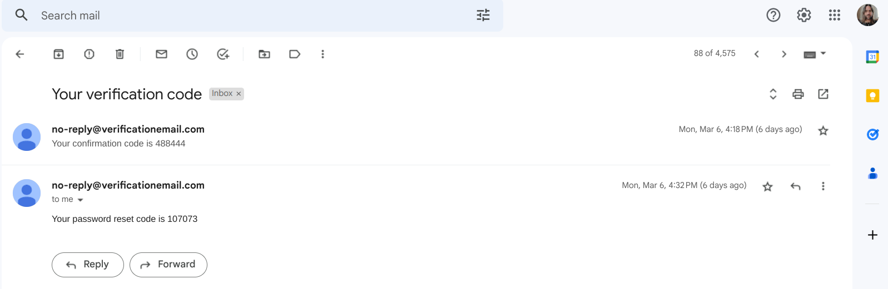

# Week 3 — Decentralized Authentication

## Homework

#### [Watch Week 3 Decentralized Authentication](https://www.youtube.com/watch?v=9obl7rVgzJw)
* #### I had to go back on this one again, but once I followed it through a second time I got everything setup correctly. Configuring the user pool properly is a bit challenging but once you go through it a couple of times it makes sense. Practice makes perfect!

#### [Watch Ashish's Week 3 - Decenteralized Authentication](https://www.youtube.com/watch?v=tEJIeII66pY&list=PLBfufR7vyJJ7k25byhRXJldB5AiwgNnWv&index=39)
* #### A good breakdown from Ashish here covering Amazon Cognito security as well as other authentication methods including OAuth, OpenID Connect, SAML, and SSO. He also covered some Cognito security best pracitices like using AWS WAF for allow and deny rules based on geolocation, Cloudtrail for monitoring to trigger alerts on malicious Cognito behaviour, and Service Control Policies to manage user pool deletion, creation, and region locks.

#### [Watch Chirag Week 3 - Spending Considerations (Not yet posted)]()
* #### Unfortunately Chirag was unable to post a video, but hopefully he'll get one up in the future.

#### Setup Cognito User Pool
* #### I got my user pool properly setup so I could authenticate users.

#### Implement Custom Signin Page
* #### Signin page implemented

#### Implement Custom Signup Page
* #### Signed up two users and confirmed with an email confirmation code.

* #### Verified the user with the email confirmation code.

#### Implement Custom Confirmation Page
* #### Added the custom message that confirmed you were signed in and authentication was also confirmed. Andrew went with a Lore quote, who was responsible for the death of all colonists on Omicron Theta. I went with the guy that was intrumental in creating a weapon that destroyed Alderaan.

#### Implement Custom Recovery Page
* #### I got the recovery code implementation going that sends a recovery code to your email in case you forget your password.
* #### Recovery Page

* #### Recovery code from email

#### [Watch about different approaches to verifying JWTs](https://www.youtube.com/watch?v=nJjbI4BbasU&list=PLBfufR7vyJJ7k25byhRXJldB5AiwgNnWv&index=43)
* #### Great info here about JWTs and using different libraries to help with authentication. Also a good breakdown on different ways to decouple your application authentication using middleware, API Gateway, or a sidecar container. There are pros and cons to each design that need to be thought over and implemented differently depending on your desired outcome and budget.
