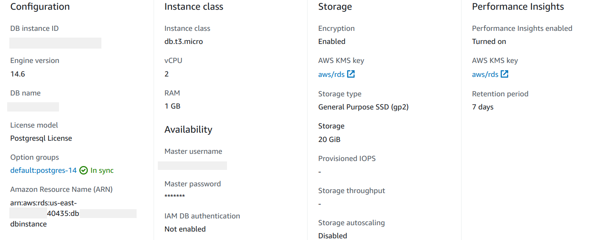
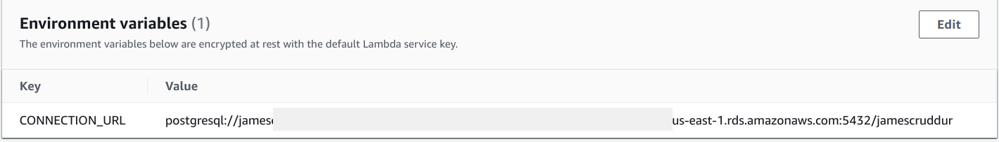
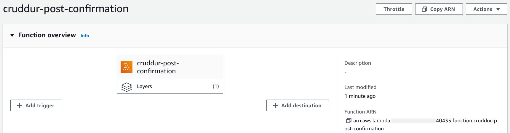
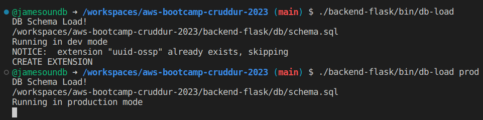
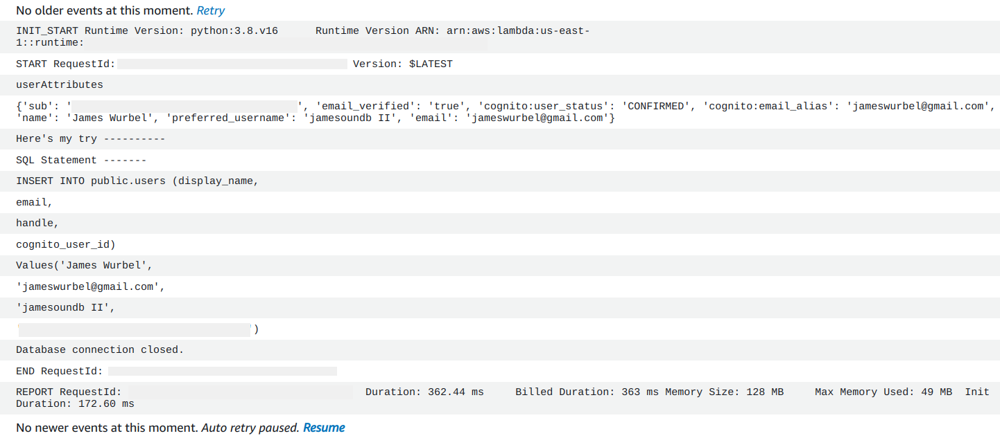
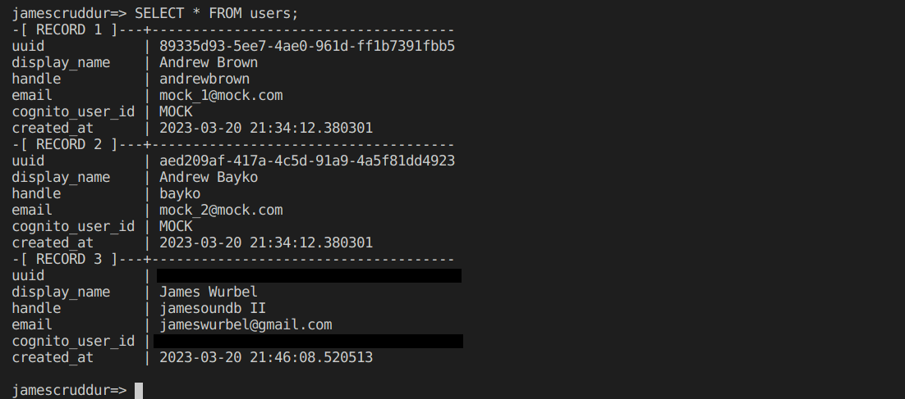
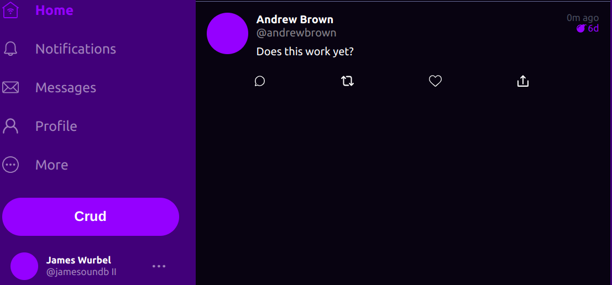
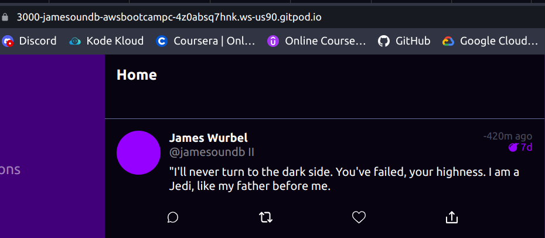
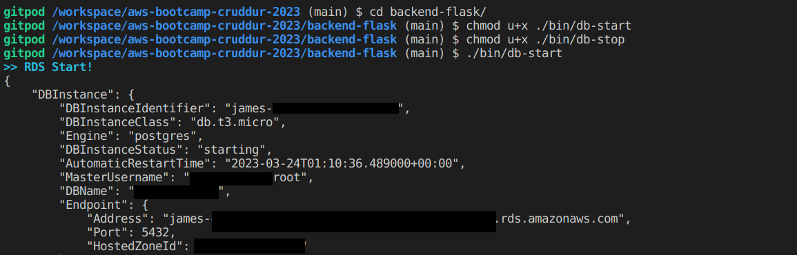
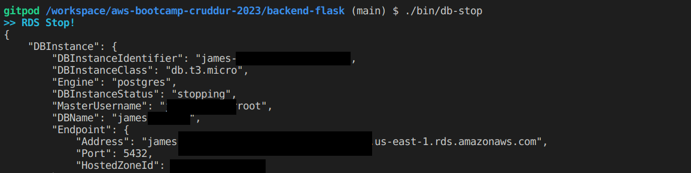

# Week 4 — Postgres and RDS

## Homework

#### [Watched Ashish's Week 4 - Security Considerations](https://www.youtube.com/watch?v=UourWxz7iQg&list=PLBfufR7vyJJ7k25byhRXJldB5AiwgNnWv&index=45)
* ##### Ashish went through a ClickOps demo of setting up an Amazon RDS Postgres database and he covered best practices when using RDS Postgres.

#### [Create RDS Postgres Instance](https://www.youtube.com/watch?v=EtD7Kv5YCUs&list=PLBfufR7vyJJ7k25byhRXJldB5AiwgNnWv&index=46)
* #### Used the AWS cli to run a script to create an instance instead of doing ClickOps, this is definitely a lot easier than wrestling with the console.

#### [Bash scripting for common database actions](https://www.youtube.com/watch?v=EtD7Kv5YCUs&list=PLBfufR7vyJJ7k25byhRXJldB5AiwgNnWv&index=46)
* #### Created several Bash scripts to help with automating some database tasks including creating the database, connecting to it, dropping the database, setting up the database, listing active sessions, loading schema, and loading seed data. Conditionals were used to indicate if the script were to act on the local database or the Amazon RDS database.

#### [Install Postgres Driver in Backend Application](https://www.youtube.com/watch?v=Sa2iB33sKFo&list=PLBfufR7vyJJ7k25byhRXJldB5AiwgNnWv&index=47)
* #### Added psycopg libraries psycopg[binary] and psycopg[pool] to requirements.txt and did a pip install -r requirements.txt. This allows connections to the RDS instance.

#### [Connect Gitpod to RDS Instance](https://www.youtube.com/watch?v=Sa2iB33sKFo&list=PLBfufR7vyJJ7k25byhRXJldB5AiwgNnWv&index=47)
* #### Using the connection bash script that was created earlier allowed us to connect our workspace to the RDS instance. An update to the SG rule was needed because everytime the workspace spins up a new IP address is allocated. 
* #### I created two scripts one for Codespaces and one for Gitpod to allow the SG rule to be updated with the proper workspace IP addresses. I updated both my Codespaces secrets and my Gitpod variables to include the necessary $DB_SG_ID and $DB_SG_RULE_ID envars. 
* #### The $GITPOD_IP envar was added to the .gitpod.yml file and then I added the $CODESPACES_IP envar to my postCommandCreate bash script. These IP addresses were obtained by running the curl ifconfig.me command. 

#### [Create Congito Trigger to insert user into database](https://www.youtube.com/watch?v=7qP4RcY2MwU&list=PLBfufR7vyJJ7k25byhRXJldB5AiwgNnWv&index=48)
* #### Created a Lambda function that was triggered to add a user to the RDS when sign up was confirmed through Cognito. The function needed to have an envar for the database connection as well as configuration and permissions set for the trigger to occur.

* #### A Lambda layer was created which allows developers to separate their code and its dependencies. It can also reduce the size of the deployment packages and improve maintainability and reusability of the code. 

* #### We needed to then update our schema in our RDS to be able to add this user to the database, we also loaded some mock data to make sure it was implemented correctly.

* #### After a few attempts and then placing the Lambda function in our default VPC the Lambda function was successfully triggered when a user signed up to the Cruddur application and was confirmed by Cognito. This added a new user to our database.

* #### Mock data and new user added

#### [Create new activities with a database insert](https://www.youtube.com/watch?v=fTksxEQExL4&list=PLBfufR7vyJJ7k25byhRXJldB5AiwgNnWv&index=49)
* #### Went through the video and got everything implemented but was stuck on having my user be attributed to the crud. Here's the first implementation:

* #### After searching through Discord I found the issue was addressed so I followed the instructions listed [here](https://discord.com/channels/1055552619441049660/1086233246691495968/1086233246691495968)
* #### Once I made these changes I was able to get a crud up with my name attributed, I figured a Star Wars quote was appropriate.

## Homework Challenges
* #### I made a script to start and stop my RDS instance using the AWS cli, it's pretty simple and it's easier to do this than doing it from the console. I added an $RDS_INSTANCE envar to handle my instance name.

