# Week 5 — DynamoDB and Serverless Caching

## Homework

#### [Watched Week 5 - Data Modelling (Live Stream)](https://www.youtube.com/watch?v=5oZHNOaL8Og&list=PLBfufR7vyJJ7k25byhRXJldB5AiwgNnWv&index=50)
* #### This was a great video discussing the intricacies of DynamoDb as well as access patterns. There was no coding/implementation involved here just theory and diagraming how we would go about implementing DynamoDb and the access patterns we would need to utilize for the Cruddur application. Kirk Kirkconnell was a great guest instructor with many years of practice which helped us layout all that was needed to accomplish our desired outcome.

#### [Watched Ashish's Week 5 - DynamoDB Considerations](https://www.youtube.com/watch?v=gFPljPNnK2Q&list=PLBfufR7vyJJ7k25byhRXJldB5AiwgNnWv&index=52)
* #### Ashish delivered another great video covering security best practices when working with DynamoDb. He covered VPC endpoints, using SCP's to help prevention of table deletions, enabling CloudTrail monitoring and alert triggers to detect malicious behaviour, and where DynamoDb should be located regionally.

#### Implement Schema Load Script
* #### Created a schema load script for the local DynamoDb which created the cruddur-messages table and loaded the schema for it. This was a python script using the boto3 module unlike the previous bash scripts that were used for the postgres database.
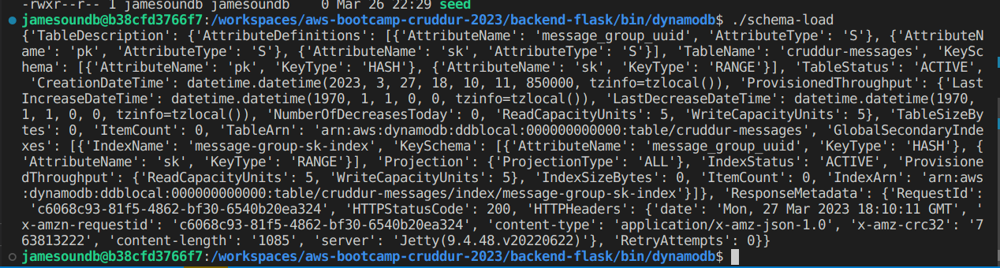

#### Implement Seed Script
* #### Created a python seed script using the boto3 module to add some mock conversation data to the local DynamoDb cruddur-messages table. I also replaced some user values with my user as well as updating the seed values of the postgres database to include my user and a certain Sith Lord.
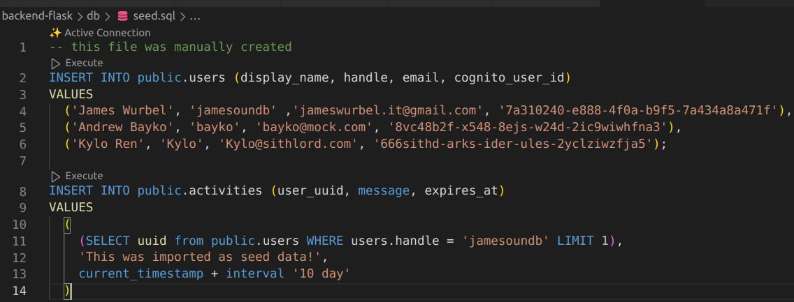
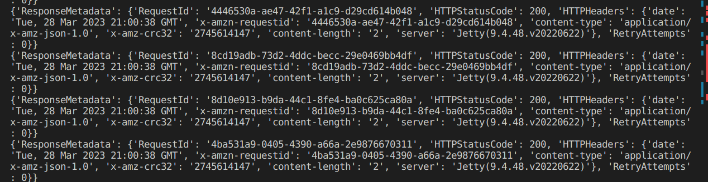

#### Implement Scan Script
* #### Created a python script using the boto3 module to scan the local DynamoDb to ensure that the seed data was loaded correctly.
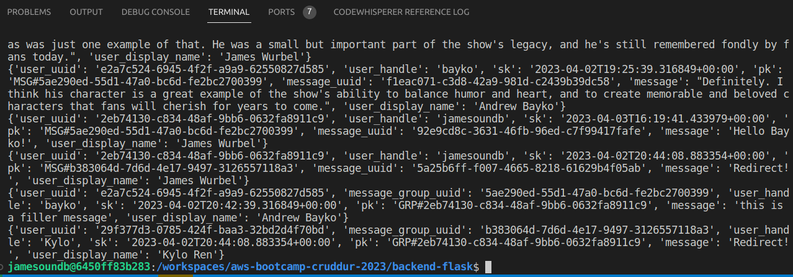

#### Implement Pattern Scripts for Read and List Conversations
* #### Created two more python scripts using the boto3 module to get the conversations and list the conversations in the local DynamoDb.
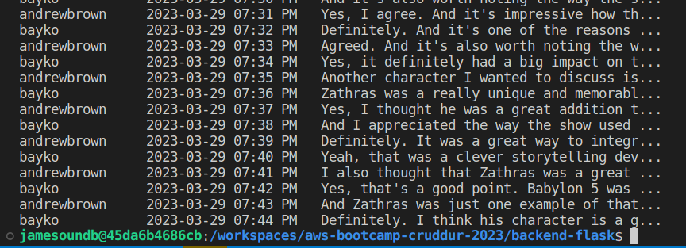
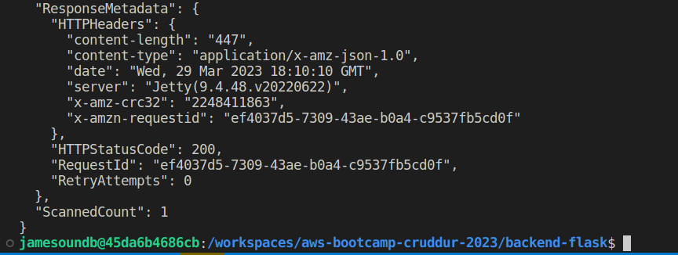

#### Implement Update Cognito ID Script for Postgres Database
* #### Created a python script to update the cognito user ids in the local postgres database. The cognito user pool id was needed to make this work and this was referenced with an environment variable in the script. A call to run this script was added to the setup script in ./bin/db/setup and at first it wouldn't work. Instead of using the bash source command python3 was used to execute the script. 
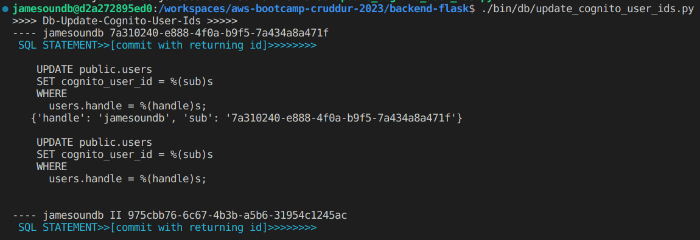

#### Implement Patterns A through E
* #### I needed to create a DynamoDb class just as I created a postgres class to use the methods of the class for certain operations. I created a ddb.py file to define this class and it's methods. I also updated the AWS_ENDPOINT_URL in my docker compose file to use my local DynamoDb.

* #### Other updates were made in the app.py file routes to get messages and message groups instead of the hardcoded values.

* #### Created a file in backend-flask/db/sql/users named uuid_from_cognito_user_id.sql.

* #### In backend-flask/bin/ddb/patterns I added a current_year variable to get-conversations.py and list-conversations.py to add to query_params and in get-conversation.py I updated the items reverse method to use the easier reverse function. I assigned items.reverse() to the reversed_array variable then used that in the for loop afterwards. This was not done in the video, but I caught the mistake.

* #### Updates to the messages.py and group_messages.py files in the backend-flask/services directory.

* #### Updates to the frontend for message group uuids included changes to the path to "/messages/:message_group_uuid".

* #### The MessageForm.js file was updated with message_group_uuid and the MessageGroupItem.js file was updated with the path {`/messages/`+props.message_group.uuid}".

* #### A checkAuth function was created in the frontend to authorize the user instead of using cookies. This function was first abstracted out of the HomeFeed.js page into its own file and then imported into the HomeFeed.js page to pass the token for authorization. 

* #### I went ahead and imported the checkAuth function into the other frontend pages that needed it for authorization as well. These pages were the MessageGroupNewPage.js, MessageGroupPage.js, MessageGroupsPage.js, NotificationsFeedPage.js, and UserFeedPage.js. 

* #### Created MessageGroupNewItem.js in frontend-react-js/src/components and MessageGroupNewPage.js in frontend-react-js/src/pages. Updates were also made to frontend-react-js/src/App.js to import MessageGroupNewPage as well as add the path "/messages/new/:handle" and element MessageGroupNewPage values.

* #### Update to frontend-react-js/src/components/MessageGroupFeed.js to import MessageGroupNewItem and add conditional for message_group_new_item.

* #### To create a new message I needed to update the create_message.py file to import the db and Ddb classes. Updates to the CreateMessage class in create_message.py added the mode parameter to the run method and then added conditionals to check if a message needed to be updated or created. I used the create_message method and the create_message_group from the Ddb class as well.

* #### Created the file backend-flask/db/sql/users/create_message_users.sql

* #### I updated Ddb.py list_message_groups method and create_message_group methods and created the users_short.py file in backend-flask/services

* #### I  creatd short.sql in backend-flask/db/sql/users and users_short.py in backend-flask/services

* #### Here is a the seed data being displayed after everything was implemented
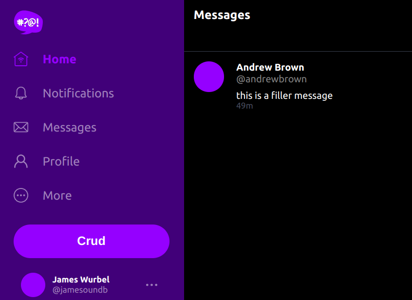

* #### Next I changed my seed data to display some of my usual Star Wars flair. Hey you've got to have fun with this stuff, right? You can see my conversation here with Kylo Ren and I had to enter in http://localhost:3000/messages/new/Kylo to get the conversation with him. I'm using a local environment for most of my stuff now instead of using Gitpod or Codespaces because it's a lot faster and you can just leave your containers up and running. Huge shout out to Jason Paul again for his article in making this implementation. I am still trying to maintain all environments though with separate docker-compose files as well just in case I might be able to help other bootcampers debug their environment.
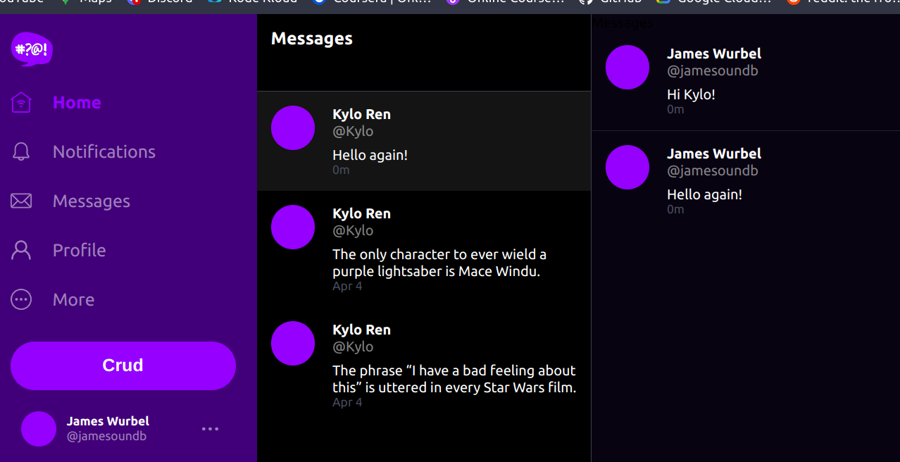
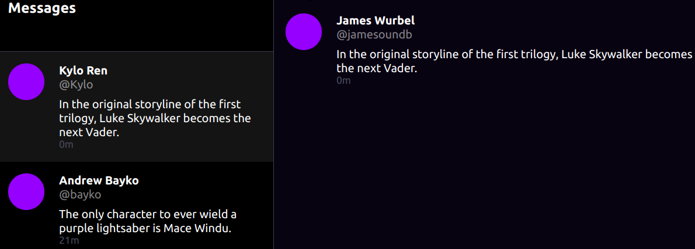

* #### Finally it was time to implement the Lambda function which was triggered by DynamoDb streams. I had to comment out the AWS_ENDPOINT_URL envar to use the the production Dynamodb and then setup that table by running the schema-load.py script with the prod arguement. In the console I enabled the Dynamodb streams with new image selected and then I created a VPC endpoint named ddb-cruddur.

* #### I created the Lambda function in aws/lambdas called cruddur_messaging_stream.py and I also added the pretty print module to it to display the event data in a more readable format. I tried wrestling with this code for a while because I didn't like the Key errors that were being thrown, it just didn't make sense to me. I even used ipython to drill down into the json that was returned and from what I could see the NewImage key did in fact exist but the error was still there. Anyways I ended up using the code provided and everything worked as expected.

* #### Created the Lamdba trigger name cruddur-messaging-stream-1 in the console and added the Lambda function code.

* #### CloudWatch Logs for the Lambda trigger, you can see the pretty print module at work here as everything under <<<<<<< Event Data >>>>>>>> looks much nicer and is in a more human readable format.
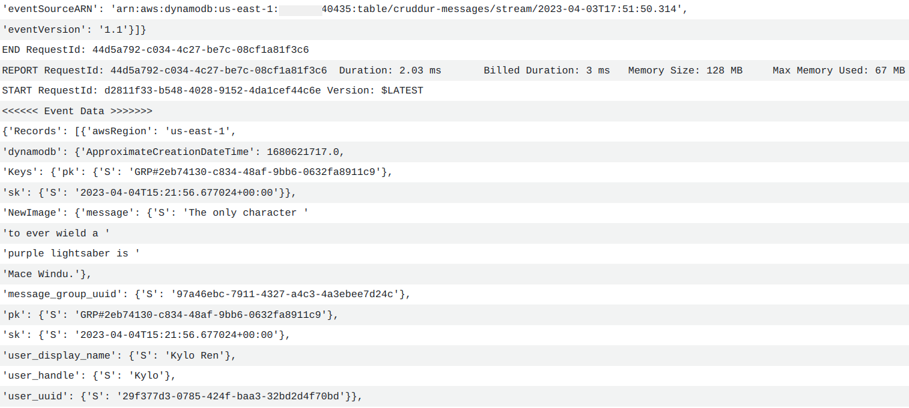

* #### DynamoDb Items 
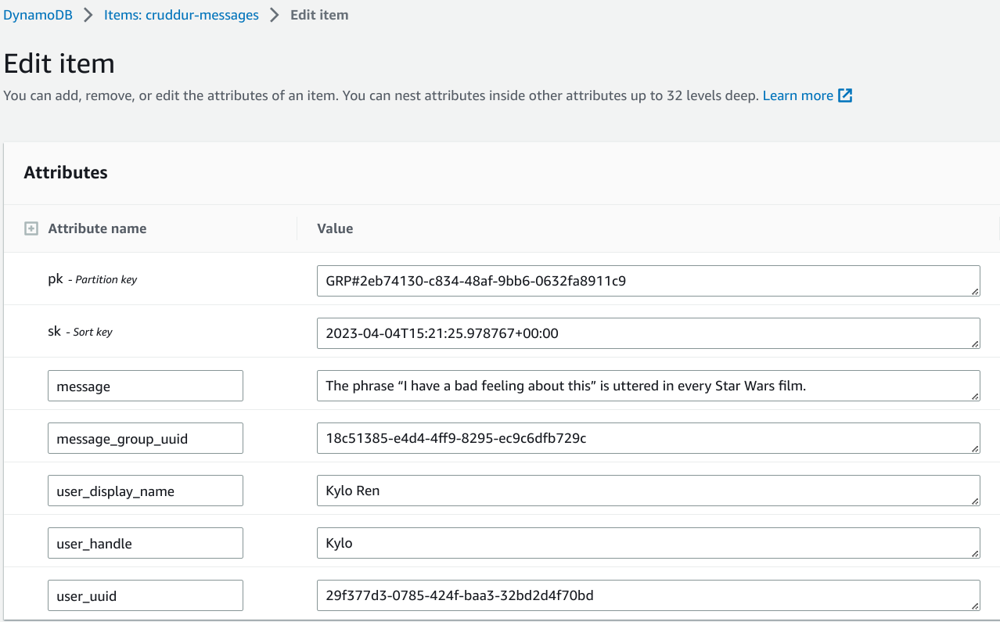
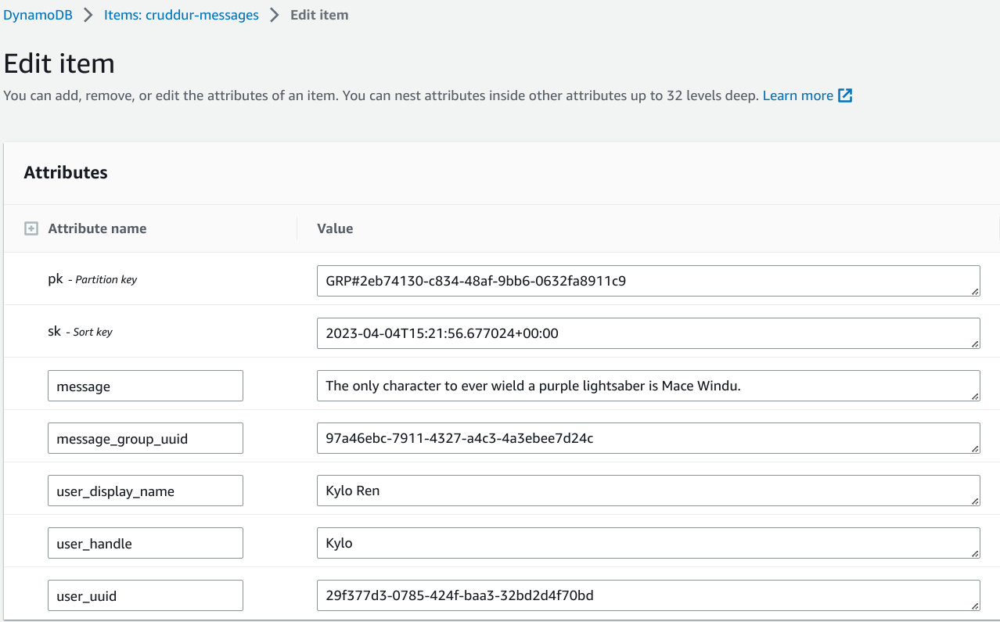

* #### Lambda Function and trigger set for DynamoDb
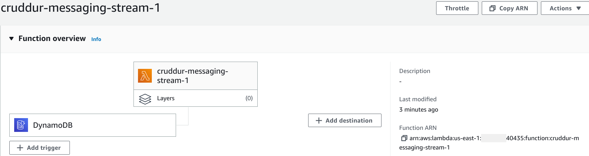

* #### VPC endpoint named ddb-cruddur for DynamoDb stream
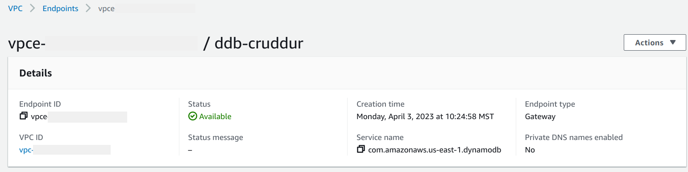

* #### Parsing the event data json in ipython trying to drill down to the correct value for the NewImage key which claimed didn't exit but I could see it was correct.
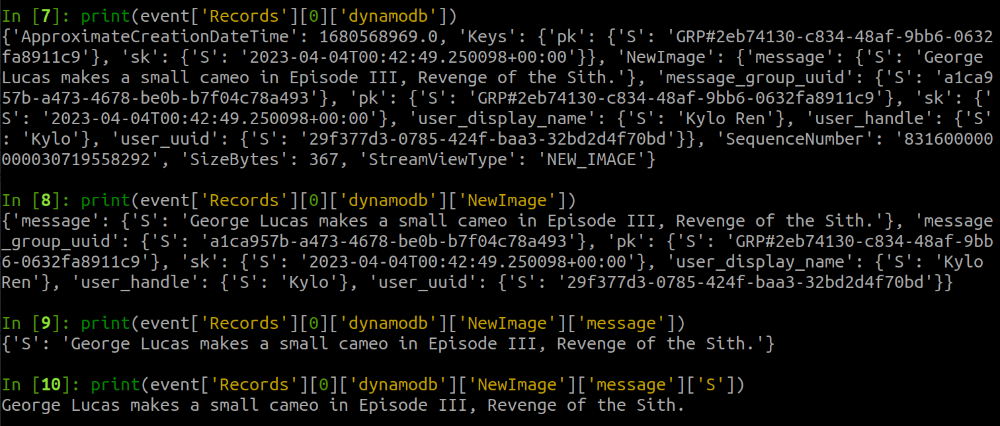
