# Week 6 & 7 — Deploying Containers and Fargate

## Homework

#### [Watch ECS Security by Ashish](https://www.youtube.com/watch?v=zz2FQAk1I28&list=PLBfufR7vyJJ7k25byhRXJldB5AiwgNnWv&index=57)
* Ashish discusses the securtiy best practices for ECS including public vs. private repos for ECR, Amazon ECR Image scan, VPC Endpoints, Security Groups, using SCP to manage task deletions, ECS creation as well as using CLoudTrail and AWS Config Rules.

#### [Watch Fargate Technical Questions with Maish](https://www.youtube.com/watch?v=w_YcwJxvoHQ)
* A great interview here discussing Fargate and how it works, with other technical questions covering best practices for running containers.

#### [Provision ECS Cluster, Create ECR repo, push image for backend-flask, and Deploy Backend Flask app as a service to Fargate](https://www.youtube.com/watch?v=QIZx2NhdCMI&list=PLBfufR7vyJJ7k25byhRXJldB5AiwgNnWv&index=58)
* covered spend considerations for Fargate 
* added health check route to app.py
* made an RDS test connection Python script 
* created a flask health check script
* created a CloudWatch log Group for the backend
* created the cruddur cluster in ECS 
* created the backend repo and base image 
* logged into ECR through aws cli
* went through the workflow of logging into ECR 
* setting the ECR_BACKEND_FLASK_URL envar to tag the backend image after it was built then pushed it to ECR 
* updated my Dockerfile to pull the image from ECR
* created the service execution policy json file
* set OTEL_EXPORTER_OTLP_HEADERS envar to create parameters in Systems Manager using the cli 
* setup CruddurServiceExecutionRole and CruddurTaskRoles roles and attached policies to these roles 
* registered task definitions for backend
* created Security Group for the cluster 
* created service with VPC attached and security group attached 
* created the service with the cli and connected to the container 
* created ECS connect script
* edited the default security group to allow backend-flask to connect to RDS 
* recreated backend service with service connect and verify they work
* created task definition for the frontend container
* created a production Dockerfile for frontend, a nginx conf file, and add frontend-react-js/build/* to .gitignore

#### [Create ECR repo and push image for fronted-react-js](https://www.youtube.com/watch?v=HHmpZ5hqh1I&list=PLBfufR7vyJJ7k25byhRXJldB5AiwgNnWv&index=59)
* execute npm run build in frontend directory
* run docker build for frontend image
* created frontend repo in ECR
* set the ECR_FRONTEND_REACT_URL envar to tag the image and then push to ECR frontend repo

#### [Deploy Frontend React JS app as a service to Fargate](https://www.youtube.com/watch?v=HHmpZ5hqh1I&list=PLBfufR7vyJJ7k25byhRXJldB5AiwgNnWv&index=59) 
* register the task definition for the frontend and created the service for the frontend using the aws cli
* rebuild frontend image to run locally for debugging
* run the frontend locally to execute docker inspect
* realized I can't shell into the frontend with bash only sh and wrote a specific script for frontend connect
* updated the frontend task definition to include a curl health check and then registered the new task definition

#### [Provision and configure Application Load Balancer along with target groups](https://www.youtube.com/watchv=HHmpZ5hqh1I&list=PLBfufR7vyJJ7k25byhRXJldB5AiwgNnWv&index=59) 
* created an ALB and security group for the backend and frontend containers to only listen through the ALB 
* created target groups for the ALB to reference the backend container and frontend container
* edited the security group for the frontend and the backend
* edited the securtiy group to include port 3000 and allow for ALB security group
* created an S3 bucket with bucket policy attached to store access logs for the ALB

#### [Manage your domain using Route53 via hosted zone](https://www.youtube.com/watch?v=HHmpZ5hqh1I&list=PLBfufR7vyJJ7k25byhRXJldB5AiwgNnWv&index=59) 
* transfer the nameservers to my registrar from route 53
* created a public hosted zone in route 53
* created HTTP and HTTPS listeners, redirect HTTP to HTTPS, and forward HTTPS to cruddur frontend target group

#### [Create an SSL cerificate via ACM](https://www.youtube.com/watch?v=HHmpZ5hqh1I&list=PLBfufR7vyJJ7k25byhRXJldB5AiwgNnWv&index=59) 
* request a public certificate from ACM

#### [Setup a record set for naked domain to point to frontend-react-js](https://www.youtube.com/watch?v=HHmpZ5hqh1I&list=PLBfufR7vyJJ7k25byhRXJldB5AiwgNnWv&index=59) 
* created an A record pointing to the ALB for jameswurbel-cruddur.com

#### [Setup a record set for api subdomain to point to the backend-flask](https://www.youtube.com/watch?v=HHmpZ5hqh1I&list=PLBfufR7vyJJ7k25byhRXJldB5AiwgNnWv&index=59) 
* created an A record pointing to the ALB for api.jameswurbel-cruddur.com

#### [Configure CORS to only permit traffic from our domain](https://www.youtube.com/watchv=HHmpZ5hqh1I&list=PLBfufR7vyJJ7k25byhRXJldB5AiwgNnWv&index=59)
* fixed CORS by updating backend task definition FRONTEND_URL and BACKEND_URL with https:// in front of the domain name

#### [Secure Flask by not running in debug mode](https://www.youtube.com/watch?v=9OQZSBKzIgs&list=PLBfufR7vyJJ7k25byhRXJldB5AiwgNnWv&index=60)
* edited ALB security group inbound rules to eliminate port 3000 and 4567 rules
* edited security group rules for port 80 and 443 to only allow my IP address
* make a new prod Dockerfile in backend-flask directory with "--no-debug, --no-debugger, and --no-reload" flags in CMD
* changed dev Dockerfile to "--debug" and deleted FLASK_DEBUG envar
* created build and run scripts for frontend and backend
* investigated why Werkzeug is not good to use in prod

#### [Securing Flask (Part 2)](https://youtu.be/eaeEbeEVNMk)
* Build backend prod Docker image
* Tag the image and push it to ECR using the push script
* created deploy script to update the service in ECS
* Update docker build scripts to use absolute paths

#### [Refactor bin directory to be top level](https://www.youtube.com/watch?v=HyJOjBjieb4&list=PLBfufR7vyJJ7k25byhRXJldB5AiwgNnWv&index=62)
* moved bin directory to root directory
* create two directories in bin directory named frontend and backend
* moved backend docker related files to new backend directory and moved the frontend docker related files to the new frontend directory
* updated paths in build scripts in frontend and backend
* tried trouble shooting users_short.py by running locally
* update path for schema-load, seed, and setup scripts in db directory
* created a kill all connections script for postgres db
* updated update_cognito_user_ids.py script
* updated db.py to add the missing return in the query_object_json function
* created new bin directory in backend-flask directory and moved the health_check.py file there
* verified that messages were now working in prod
* updated RDS security group script path in devcontainer.json file for local dev container, updated path in .gitpod.yml for Gitpod and updated the path in postCommandCreate script for Codespaces

#### [Implement Refresh Token for Amazon Cognito](https://www.youtube.com/watch?v=LNLP2dxa5EQ&list=PLBfufR7vyJJ7k25byhRXJldB5AiwgNnWv&index=63)
* update checkAuth.js refresh access_token
* update HomeFeedPage.js to get access token
* update .js pages with import { checkAuth, getAccessToken }
* update .js pages to await getAccessToken(), const access_token, and Authorization in headers

#### [Configure task definitions to contain x-ray and turn on Container Insights, Change Docker Compose to explicitly use a user-defined network, Create Dockerfile specfically for production use case, Using ruby generate out env dot files for docker using erb templates](https://www.youtube.com/watch?v=G_8_xtS2MsY&list=PLBfufR7vyJJ7k25byhRXJldB5AiwgNnWv&index=64)
* added xray config to backend and frontend task definitions
* created two register task definition scripts named register for the frontend and the backend located in each directory
* created docker run scripts in bin/backend and bin/frontend to run backend and frontend containers locally
* created backend-flask-local.env, backend-flask-codespaces.env, and backend-flask-gitpod.env files
* created frontend-react-js-local.env, frontend-react-js-codespaces.env, and frontend-react-js-gitpod.env file
* added envars from docker compose files to the .env files for the frontend and backend
* created generate-env-local, generate-env-codespaces, generate-env-gitpod files in bin/backend directory
* created generate-env-local, generate-env-codespaces, generate-env-gitpod files in bin/frontend directory
* created erb directory and created three .env.erb files for the backend and three for the frontend matching their repective dev environments for Gitpod, Codespaces, and Local development
* updated docker compose file with cruddur-net network name
* updated .gitignore file to included \*.env
* created busybox docker run script
* updated the cluster in the console to use container insights

## Screenshots
* #### Hitting the backend api endpoint health check
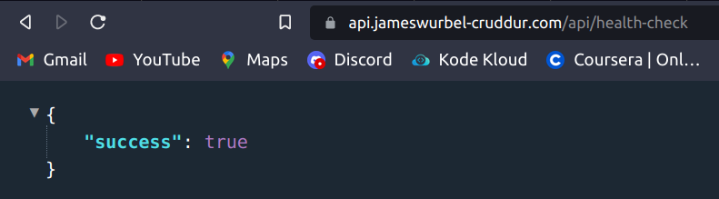
* #### Hitting the backend api endpoint for /activities/home
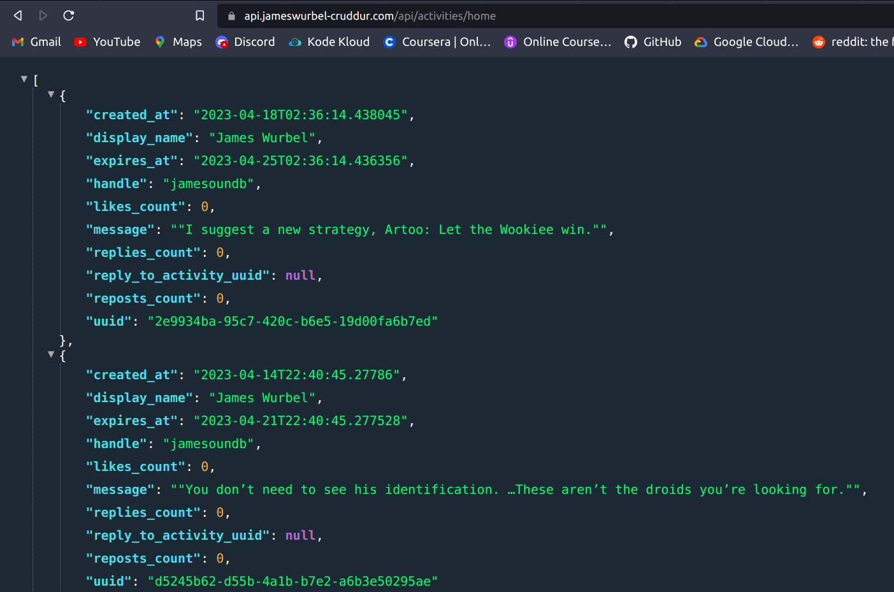
* #### Connecting to the backend container
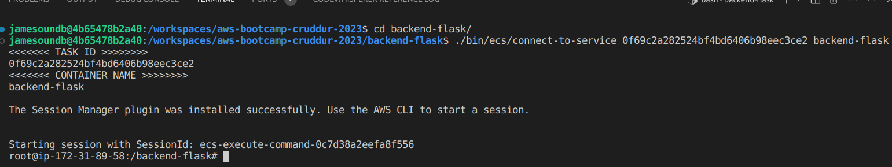
* #### Backend task definition
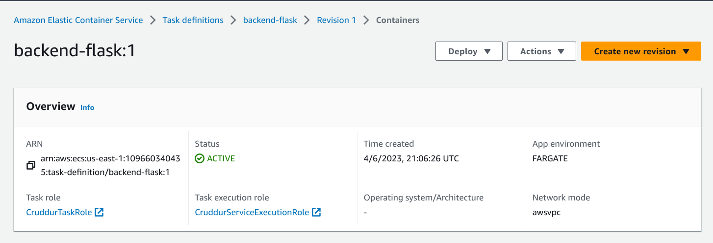
* #### ECS with ALB and Listeners
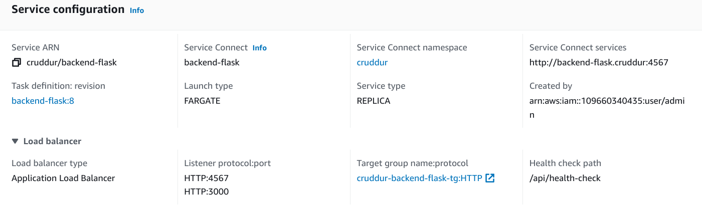
* #### Working frontend with DNS and certificate
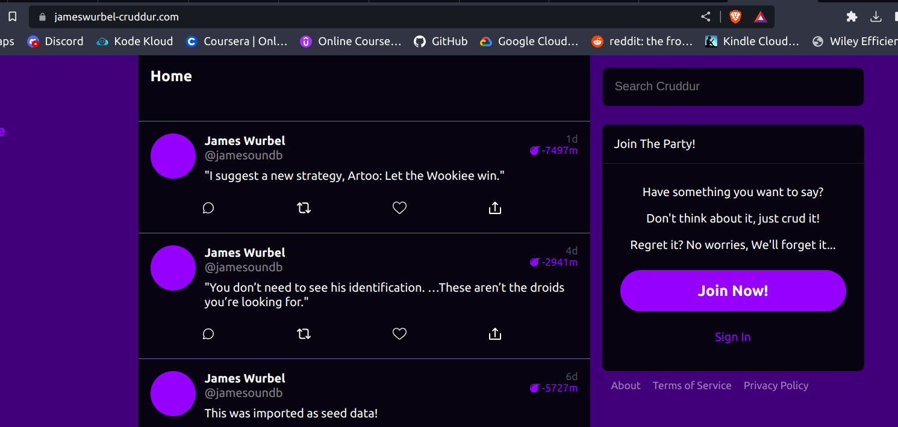
* #### Messages working with DNS and certificate
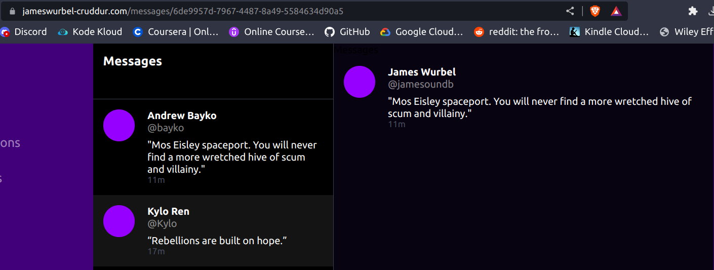
* #### New messages with DNS and certificate
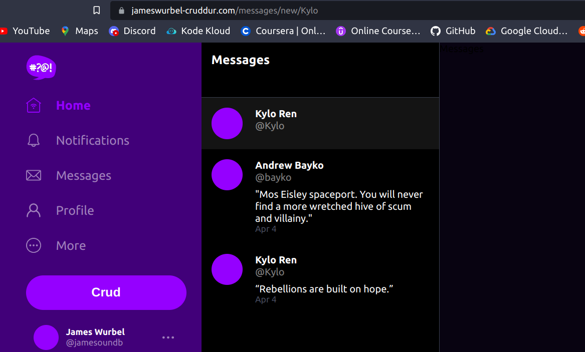
* #### Frontend notifications page with DNS and certificate
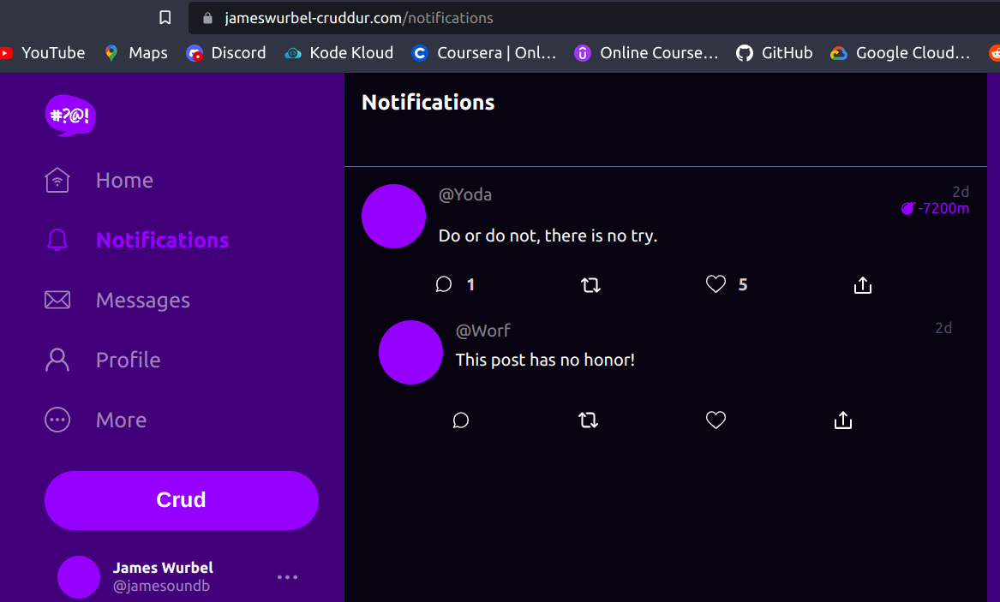
* #### Users @short backend endpoint with DNS and certificate
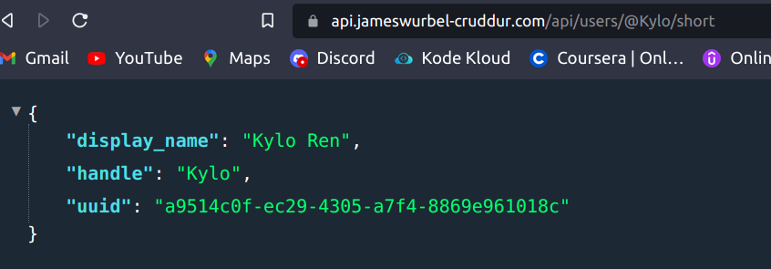
* #### Shell into frontend prod container
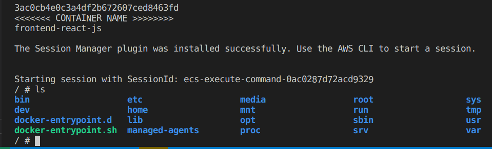

* #### For more screenshots and proof of work go [here](https://github.com/jamesoundb/aws-bootcamp-cruddur-2023/tree/main/journal/assets/week_6)

## Homework Challenges

#### Created a cluster service create and delete script using bash and the aws cli tool. 
* I wanted to have a script that would create my frontend and backend services and another one to delete them. The script can be used to create or delete both services or just one depending on the arguments that you pass to it. This was super helpful to use to limit spend because there is no reason to keep the cluster running if I wasn't working on it and I didn't want to keep going back and forth in the console to delete or create these services. These scripts are located at ./bin/ecs/create-service and ./bin/ecs/delete-service.
#### Maintaining all three dev environments
* In line with trying to keep up with maintaining all three dev environments Gitpod, Codespaces, and Local I needed to create .env files and .env.erb files for the frontend and for the backend for all three environments. I also had to create three generate-env files for the backend and three for the frontend so they would read the correct .env.erb files to generate the correct envars depending on what environment I was using. Definitely a lot more work than I was expecting to maintain all of these but I got it working in the end.
#### Creating a script to modify the security group for the ALB
* I created another script that was very similar to the rds-security-update script but it was for the alb security group instead. It modifies the the alb security group to allow access to the frontend and backend from your current IP address. I was able to get the script to work from my local dev environment but I was unable to modify it to work for Codespaces or Gitpod when you start those environments. The reason being was there was no way that I could find to get the IP address for your local machine from within the Codespaces or Gitpod environments. When you run the curl ifconfig.me command on start up of the Codespaces or Gitpod environments it will only grab the IP address of the container workspace. I tried multiple ways to get my machine's address but was unable to come up with a solution that ran the script on start up of either of those workspaces. Instead my solution was to just hard code my IP address in the .gitpod.yml file for Gitpod and hard code it in the postCreateCommand script. My local dev environment however was able to grab the IP address of my machine just fine because that environment runs strictly on my machine. Hopefully I will be able to find a solution for the Codespaces and Gitpod environments in the future.
